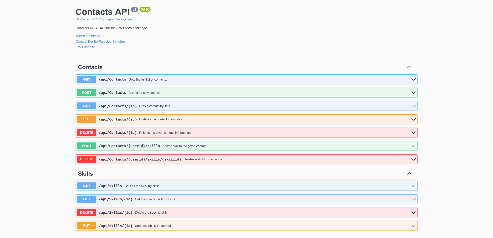

# Contactor: OWT candidate tech challenge

<!-- markdownlint-disable MD033 -->
<p align="center">
  <a href="https://github.com/pleonex/owt-challenge">
    
  </a>
  &nbsp;
  <a href="https://github.com/pleonex/owt-challenge/workflows/Build%20and%20release">
    
  </a>
  &nbsp;
  <a href="https://choosealicense.com/licenses/mit/">
    
  </a>
  &nbsp;
</p>

A web API to create and update the user's contacts.



## Tech stack

- **Backend**:
  - ASP.NET Core 8.0
  - SQLite
- **Documentation**: DocFX, Swagger, GitHub page
- **CI**: GitHub Actions
- **DevOps workflow**:
  - [Cake](https://cakebuild.net/)
  - [PleOps Cake](https://www.pleonex.dev/PleOps.Cake/) repo template and build
    system
- **Release deployment**: GitHub, Docker

## Get started

Check-out the [documentation site](https://www.pleonex.dev/owt-challenge).

## Build

The project requires to build .NET 8.0 SDK.

To build, test and generate artifacts run:

```sh
# Build and run tests (with code coverage!)
dotnet run --project build/orchestrator

# (Optional) Create bundles (nuget, zips, docs)
dotnet run --project build/orchestrator -- --target=Bundle
```

## Release

Create a new GitHub release with a tag `v{Version}` (e.g. `v2.4`) and that's it!
This triggers a pipeline that builds and deploy the project.
