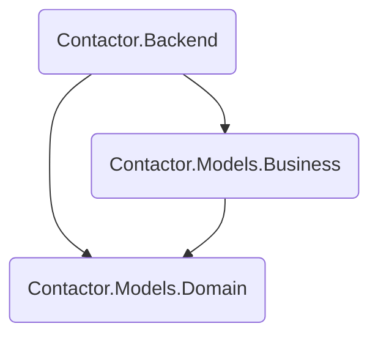
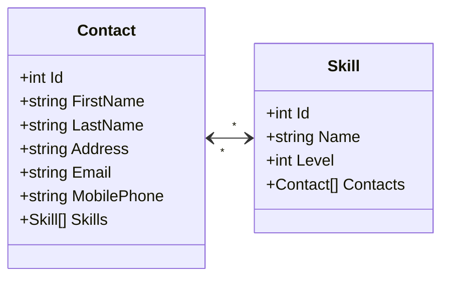
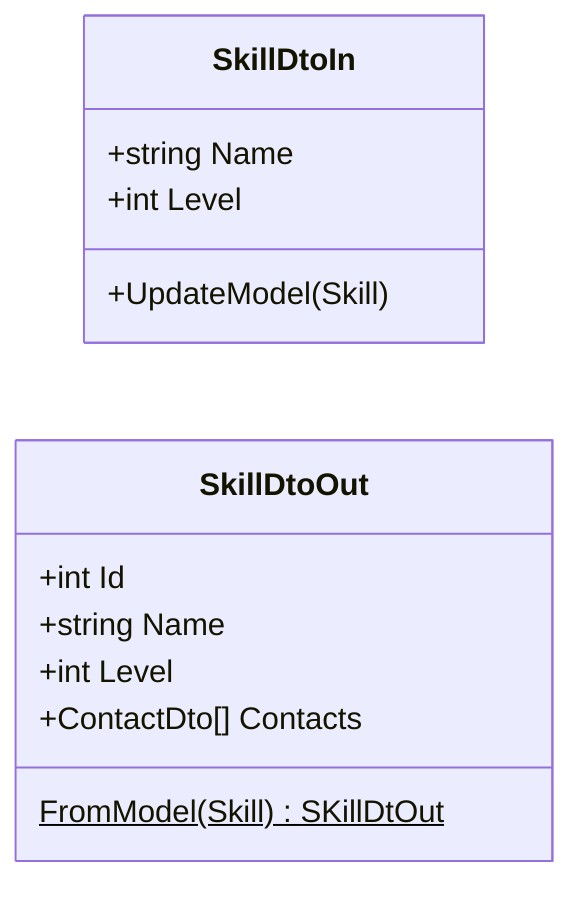

# Project architecture

This projects provides a web API to manage a contacts list.

## Technologies

The projects uses .NET technologies and C# programming language. The backend
uses the ASP.NET Core framework with the .NET 8.0 LTS runtime.

The OpenAPI supports is provided by the
[_Swashbuckle_](https://github.com/domaindrivendev/Swashbuckle.AspNetCore)
library.

The backend persists the data into an SQLite database. As the project didn't
have requirements for a database, SQLite offers the benefits of a relation
database without deployment complexity. The communication goes through
_EntityFramework Core_, so changing to a different database should be relatively
cheap.

The documentation static site and .NET API docs are generated with DocFx.

The DevOps workflow uses GitHub Actions pipelines with a
[cake-based](https://cakebuild.net/) build system. The repository README file
contains instructions for building the project.

## Components

There are three main components:

- `Contactor.Models.Domain`: domain models. It defines the models and
  relationships for the database.
- `Contactor.Models.Business`: business models. It defines the models for higher
  layers (APIs). It provides a _repository_ layer to interact with the domain
  models.
- `Contactor.Backend`: web server host and REST API endpoint definition. It
  setups the dependency injection, configures the database from the app
  settings. It also defines the REST API controllers to interact with the
  business model.

## Data models

## Domain models

There are two main models:

- [`Contact`](xref:Contactor.Models.Domain.Contact): defines the information for
  a contact.
- [`Skill`](xref:Contactor.Models.Domain.Skill): defines a skill information
  associated to contacts.

The relationships with `Contact` and `Skill` is many-to-many: a contact can have
multiple skills, a skill can be associated to multiple contacts.

### Business models

The business model provides a _repository layer_ to abstract the usage of the
database via its model. The goal is to be able to test APIs like the REST
endpoints without having to interact with a database. It would also help in case
this database models are used for other applications such as desktop.

For each model, we define two _data transfer objects_:

- `in` models: type for clients to send data to the API.
  - These models implement data validation via
    `System.ComponentModel.DataAnnotations` API.
  - They do not include properties that clients shouldn't provide such as
    database IDs.
- `out` models: type to provide server data to clients
  - It includes information clients may need for queries like IDs.

This wrapping helps to prevent _overposting_ by selecting what properties are
visible and minimizes the risk of receiving data that the API do not want to
change (such as IDs).

Unit tests are implemented in the two layers: test the REST endpoints mocking
the repository and test the repository with a production test database.

## REST API

The REST API provides _CRUD_ operations for _contacts_ and _skills_:

- `api/Contacts`: create, get all, get by ID, update by ID and remove by ID
  contacts. It also allows to add and remove skills for a given contact.
- `api/Skills`: get all, get by ID, update by ID and remove by ID skills.
  - It does not allow to create skills as it was found a cleaner design to give
    this possibility via the _Contacts_ endpoint. For instance:
    `POST api/Contacts/1/skill`
