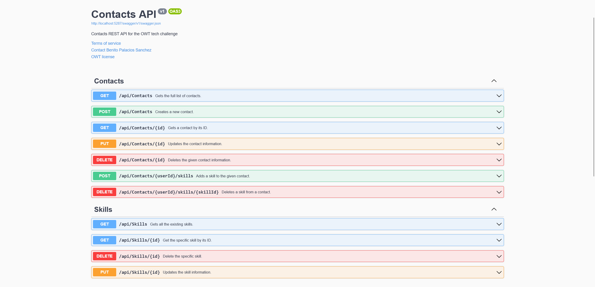

# Contactor: OWT candidate tech challenge

A web API to create and update the user's contacts.

## Tech stack

- **Backend**:
  - ASP.NET Core 8.0
  - SQLite
- **Documentation**: DocFX, Swagger, GitHub page
- **CI**: GitHub Actions
- **DevOps workflow**:
  - [Cake](https://cakebuild.net/)
  - [PleOps Cake](https://www.pleonex.dev/PleOps.Cake/) repo template and build
    system
- **Release deployment**: GitHub, Docker
